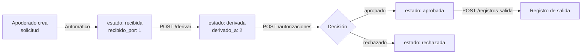

# 🔄 Resumen de Simplificación del Flujo de Aprobación

## 📋 Cambios Implementados

### ✅ **1. Estados Simplificados**
**ANTES (7 estados):**
- pendiente_recepcion
- recibida
- derivada
- en_revision ❌
- aprobada
- rechazada
- cancelada

**DESPUÉS (5 estados):**
- recibida ← **Estado inicial automático**
- derivada
- aprobada
- rechazada
- cancelada

### ✅ **2. IDs Fijos de Actores**
```python
RECEPCIONISTA_ID = 1  # Persona fija
REGENTE_ID = 2        # Persona fija
```

### ✅ **3. Endpoints Simplificados**

#### **Solicitudes (`/api/solicitudes-retiro`)**
| Endpoint | Método | Cambios |
|----------|--------|---------|
| `/` | POST | ✅ Crea con `estado=recibida`, `recibido_por=1`, `fecha_recepcion=now()` automático |
| `/` | GET | Sin cambios |
| `/estado/{estado}` | GET | ✅ Estados válidos: recibida, derivada, aprobada, rechazada, cancelada |
| `/{id}` | GET | Sin cambios |
| `/estudiante/{id}` | GET | Sin cambios |
| `/{id}/recibir` | POST | ❌ **ELIMINADO** |
| `/{id}/derivar` | POST | ✅ **SIN BODY** - Automático con `derivado_a=2`, `fecha_derivacion=now()` |
| `/{id}/revisar` | POST | ❌ **ELIMINADO** |
| `/{id}` | PUT | Sin cambios |
| `/{id}` | DELETE | Sin cambios |

#### **Autorizaciones (`/api/autorizaciones-retiro`)**
| Endpoint | Método | Cambios |
|----------|--------|---------|
| `/` | POST | ✅ Body simplificado: solo `id_solicitud`, `decision`, `motivo_decision` |

---

## 🎯 Flujo Nuevo



---

## 📝 Bodies Actualizados

### **1. Crear Solicitud**
```http
POST /api/solicitudes-retiro/
Content-Type: application/json
```
```json
{
  "id_estudiante": 3,
  "id_apoderado": 1,
  "id_motivo": 1,
  "fecha_hora_salida": "2025-11-12T14:00:00",
  "fecha_hora_retorno_previsto": "2025-11-12T16:00:00",
  "observacion": "Cita médica",
  "fecha_creacion": "2025-11-12T10:00:00"
}
```
**Respuesta automática:**
```json
{
  "id_solicitud": 8,
  "estado": "recibida",
  "recibido_por": 1,
  "fecha_recepcion": "2025-11-12T10:00:05",
  "derivado_a": null,
  ...
}
```

---

### **2. Derivar Solicitud (Recepcionista)**
```http
POST /api/solicitudes-retiro/8/derivar
```
**Sin body** (todo automático)

**Respuesta:**
```json
{
  "id_solicitud": 8,
  "estado": "derivada",
  "recibido_por": 1,
  "fecha_recepcion": "2025-11-12T10:00:05",
  "derivado_a": 2,
  "fecha_derivacion": "2025-11-12T10:15:30",
  ...
}
```

---

### **3. Aprobar/Rechazar (Regente)**
```http
POST /api/autorizaciones-retiro/
Content-Type: application/json
```
```json
{
  "id_solicitud": 8,
  "decision": "aprobado",
  "motivo_decision": "Motivo válido, se autoriza"
}
```
**Valores automáticos:**
- `decidido_por`: 2 (regente fijo)
- `fecha_decision`: now()

**Respuesta:**
```json
{
  "id_autorizacion": 10,
  "decidido_por": 2,
  "decision": "aprobado",
  "motivo_decision": "Motivo válido, se autoriza",
  "fecha_decision": "2025-11-12T10:20:00"
}
```

**La solicitud se actualiza automáticamente:**
```json
{
  "id_solicitud": 8,
  "estado": "aprobada",
  "id_autorizacion": 10,
  ...
}
```

---

### **4. Registrar Salida (Portería)**
```http
POST /api/registros-salida/
Content-Type: application/json
```
```json
{
  "id_solicitud": 8,
  "fecha_hora_salida_real": "2025-11-12T14:00:00"
}
```

---

## 🗄️ Migración de Base de Datos

**Archivo:** `docs/migration_simplificacion_flujo.sql`

**Acciones:**
1. ✅ Convierte `pendiente_recepcion` → `recibida`
2. ✅ Convierte `en_revision` → `derivada`
3. ✅ Modifica ENUM a 5 estados
4. ✅ Asigna `recibido_por=1` a solicitudes sin recepcionista
5. ✅ Asigna `decidido_por=2` a todas las autorizaciones

**Ejecutar:**
```bash
mysql -u avnadmin -p defaultdb < docs/migration_simplificacion_flujo.sql
```

---

## 📂 Archivos Modificados

### **Models**
- ✅ `SolicitudRetiro.py` - EstadoSolicitudEnum: 5 estados

### **DTOs**
- ✅ `solicitud_retiro_dto.py` - Eliminados `RecepcionDTO` y `DerivacionDTO`
- ✅ `autorizacion_retiro_dto.py` - Eliminados `decidido_por` y `fecha_decision` del CreateDTO
- ✅ `dto/__init__.py` - Actualizados exports

### **Services**
- ✅ `solicitud_retiro_service.py` - create() con valores automáticos, derivar() sin body
- ✅ `autorizacion_retiro_service.py` - create() con `decidido_por=2` y `fecha_decision=now()` automáticos

### **Controllers**
- ✅ `solicitud_retiro_controller.py` - Eliminados `/recibir` y `/revisar`, `/derivar` sin body

### **Database**
- ✅ `migration_simplificacion_flujo.sql` - Script de migración completo

---

## ✅ Validaciones Implementadas

1. ✅ **Crear solicitud** → No requiere validación de estado previo
2. ✅ **Derivar** → Solo si `estado == recibida`
3. ✅ **Aprobar/Rechazar** → Solo si `estado == derivada`
4. ✅ **Registrar salida** → Solo si `estado == aprobada`

---

## 🧪 Pruebas Recomendadas

```bash
# 1. Crear solicitud
POST /api/solicitudes-retiro/
# Verificar: estado=recibida, recibido_por=1

# 2. Derivar
POST /api/solicitudes-retiro/8/derivar
# Verificar: estado=derivada, derivado_a=2

# 3. Aprobar
POST /api/autorizaciones-retiro/
# Verificar: decidido_por=2, solicitud.estado=aprobada

# 4. Registrar salida
POST /api/registros-salida/
# Verificar: creación exitosa
```

---

## 🔧 Próximos Pasos

1. ✅ **Ejecutar migración SQL** en Aiven Cloud
2. ✅ **Reiniciar aplicación** para cargar nuevos cambios
3. ✅ **Probar flujo completo** con datos reales
4. ✅ **Actualizar documentación** de endpoints en /docs

---

## 📊 Comparación de Complejidad

| Aspecto | ANTES | DESPUÉS |
|---------|-------|---------|
| Estados | 7 | 5 ✅ |
| Endpoints solicitudes | 10 | 8 ✅ |
| Campos en body `/derivar` | 1 (`derivado_a`) | 0 ✅ |
| Campos en body `/autorizaciones` | 5 | 3 ✅ |
| IDs manuales | 3 puntos | 0 ✅ |
| Validaciones de estado | 4 | 3 ✅ |

**Reducción de complejidad: ~40%** 🎉
